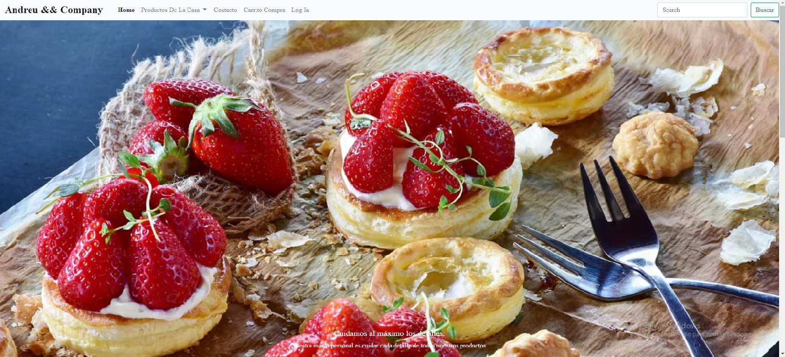

# Web Respostería Online

Proyecto creado utilizando HTML5, CSS3 y JS.

Puedes previsualizar el Proyecto haciendo click [aqui](https://andreumartinezg.github.io/WebReposteriaOnline/)

## 0. Indice:

  [1. Introduccion:](#1-introducción) 
  [2. Como usar:](#2-como-usar) 
  [3. Descripción del Proyecto:](#3-descripción-del-proyecto) 
  [4. Diseño:](#4-diseño) 
  [5. Futuras Funcionalidades:](#5-futuras-funcionalidades) 
  [6. Herramientas Utilizadas:](#6herramientas-utilizadas)

## 1. Introducción.

Proyecto de creación de página Web de Repostería ficticia con HTML5, CSS3, JS, PHP y Bootstrap para poner en práctica los conocimientos adquiridos durante la segunda semana del BootCamp de [GeeksHubAcademy](https://bootcamp.geekshubsacademy.com/).

## 2. Como Usar.

La funcionalidad estándar que tiene es la navegación por la web como cualquier otra y una lista de productos que puedes listar en un Carrito de la compra donde se añaden esos productos.

## 3. Descripción del proyecto.

El proyecto ha constado de varias partes: 

-Primero he creado una estructura básica de las diferentes páginas que engloban este sitio Web, definiendo todos los apartados y creando un encabezado común que se usará en todas las páginas.

-Una vez creada la estructura general de las páginas he ido añadiendo un diseño especifico para cada una de ellas. 

-En la página de LogIn he añadido un ReCaptcha funcional, añadiendo la Clv Publica y Privada para su correcto funcionamiento.

-Por ultimo he añadido la funcionalidad a través de JS de un carrito de compra online donde se listan los productos de las diversas páginas.

## 4. Diseño.

-La página Home cuenta con un diseño de unas imágenes desplazables al principio de la página, a continuación un apartado donde se encuentran unos links de interés sobre la misma página y una breve descripción Ficticia sobre los fundadores del establecimiento.

-En el apartado de productos de la Casa se incluyen varias páginas que engloban diferentes tipos de productos:

    -Dulces: Cuenta con una variedad de productos Dulces con la posibilidad de añadir al carrito cada producto y una vista de los productos añadidos al carrito en la propia página y en las demás que tienen esa funcionalidad.

    -Salados: Cuenta con una variedad de productos Salados con la posibilidad de añadir al carrito cada producto y una vista de los productos añadidos al carrito en la propia página y en las demás que tienen esa funcionalidad.

    -Para Beber: Cuenta con una variedad de bebidas y cafés con la posibilidad de añadir al carrito cada producto y una vista de los productos añadidos al carrito en la propia página y en las demás que tienen esa funcionalidad.

-Tambien cuenta con un apartado de Contacto en la cual puedes introducir tu email y un texto para que el propietario pudiera ponerse en contacto con el cliente y ademas iframe con la ubicación de la academia de GeeksHub Academy a modo de la ubicación del establecimiento.

-Cuenta con una página especifica de Carrito Compra donde se listan todos los productos listados en las diferentes páginas donde se pueden añadir o quitar productos de las listas y vaciar el carrito.

-En el apartado de LogIn he creado un diseño simple de entrada como usuario a la página donde he incluido un ReCaptcha funcional.

-Por ultimo todas las páginas incluyen un Footer con las diferentes redes sociales existentes, para una mayor visibilidad de la empresa!

## 5. Futuras funcionalidades.

-En un futuro me gustaría añadir la parte del BackEnd en la cual a través de una base de datos se puedan añadir de forma dinámica contenido y hacer un apartado de Registro y LogIn funcional.

## 6.Herramientas Utilizadas:

-El proyecto se ha realizado esencialmente con la herramienta VisualStudio Code.

-Bootstrap Repository.

-Herramienta de Live Server para ir viendo el proceso de construcción y comprobar el apartado Responsive de la Web.

-GitHub para el almacenamiento y el control de lo realizado en el proyecto.

[Subir](#top)

